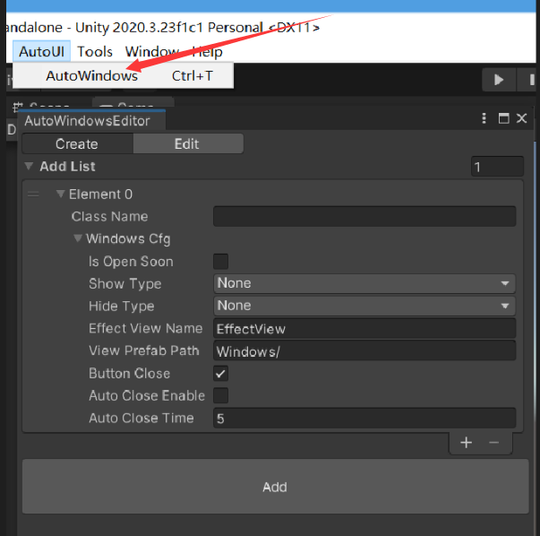
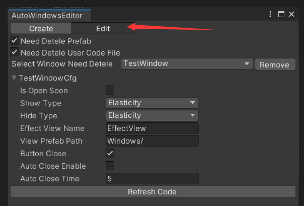
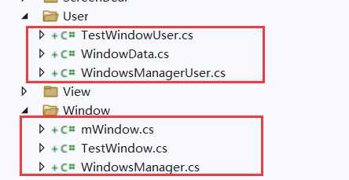
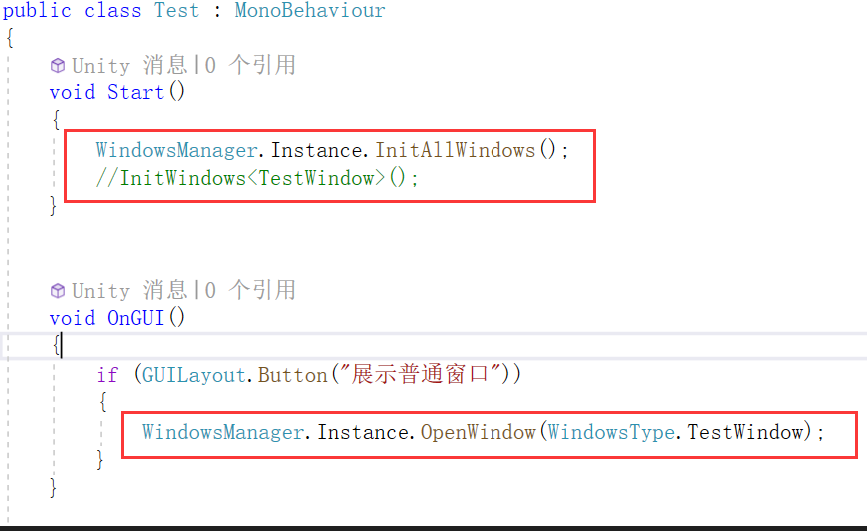
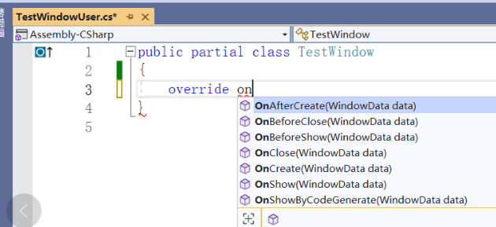
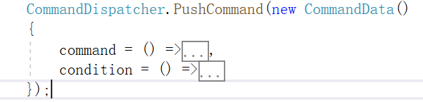

# AutoUI
  ### Unity包下载
  
  [AutoUI V0.0.1](https://github.com/Catiger1/AutoUI/blob/master/AutoUI_V0.01.unitypackage)
  
* 弹窗编辑器
>* 使用说明
>>* 导入Unity包后菜单栏出现AutoUI选项，点击并选择AutoWindows打开弹窗编辑器。
>>* 
>>* 并配置Create窗口下参数并点击Add就可以创建并生成对应模板的代码跟预制件。
>>* Create下输入参数说明：
>>>* Class Name：要生成的窗口名及代码文件类名，包括预制件名也是以此生成。
>>>* Is Open Soon：是否立即打开弹窗，默认只允许同时打开一个窗口。
>>>* Show Type、Hide Type：展示方式以及隐藏窗口的方式，当前有渐变、弹性以及直接打开或者关闭。
>>>* Effect View Name：展示方式以及隐藏方式作用的预制件名。
>>>* View Prefab Path：生成的预制件路径。
>>>* Button Close：是否有关闭按钮。
>>>* Auto Close Enable：是否使能自动关闭。
>>>* Auto Close Time：设置自动关闭的时间
>>* Edit窗口下输入参数说明：
>>* 
>>>* Need Detele Prefab：删除窗口的时候是否把预制件一起删除，默认是。
>>>* Need Detele Code File: 删除窗口的时候是否把用户代码文件一起删除，默认是。
>>>* Refresh Code：在更新配置后需要点击此按钮更新并重新生成代码，比如需要自动关闭功能，则需要在这里配置并刷新代码。
>>>* 
>>* AutoUI/User路径下文件为给用户重写的代码，在此路径下写的代码不会因为代码生成而受影响，注意移除的时候默认删除对应窗口的User文件。
>>* 
>>* 创建窗口后需要使用InitAllWindows函数直接初始化创建所有窗口实例或者单独使用InitWindow<T>()单独初始化某个窗口，之后就使用窗口名.OpenWindow()打开对应的窗口。
>>* 
>>* 窗口有不同的生命周期：OnCreate、OnAfterCreate、OnBeforeShow、OnShow、OnRecycle都可以使用代码进行重写。
>>* AutoUI/Effect下为窗口打开/关闭动效文件，可以自行编写打开关闭动效文件并添加到框架中
>>* 
>>* AutoUI/Command下CommandDispatcher.cs文件提供命令调度文件，使用双向链表构建的命令调度，通过CommandDispatcher.PushCommand(new CommandData(){})函数添加命令数据并添加进命令调度系统中，满足执行条件会执行并从命令调度系统中移除，满足移除条件则不执行直接移除，窗口中的定时关闭以及控制窗口同时只能存在一个都是依托此系统实现。
      
